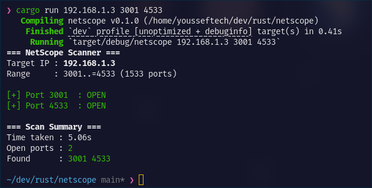

# NetScope
A simple IP scanner written in Rust.

## Description
This is my first ever Rust project and it's supposed to be a learning experience for me, there's no specific motive behind this project's idea, someone just looked at the wifi icon and suggested it and I liked it.

It's supder simple terminal based IP scanner, useful for when you wanna make sure your headless Raspberry Pi is connected to the network or not, or when you wanna see if there are any unwanted visitors on your network.