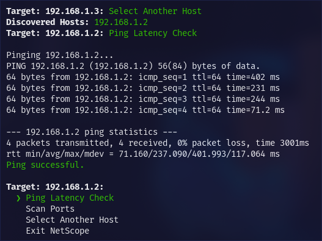
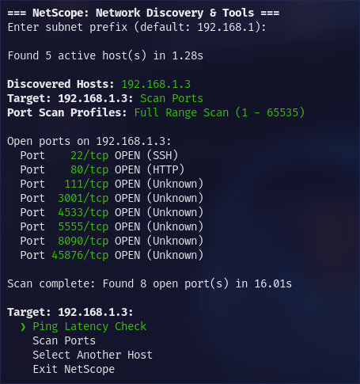
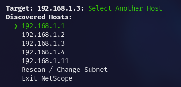

# NetScope
A fast, interactive terminal tool for local network discovery and port auditing.

NetScope was built cause traditional scanning tools like Nmap are capable, but typing out complex CLI flags just to find a device on your local network or check if SSH is running is annoying. NetScope gives you an interactive, keyboard-driven menu directly in your terminal, making local network inspection fast and straightforward.

## Table of Contents
- [NetScope](#netscope)
  - [Table of Contents](#table-of-contents)
  - [Description](#description)
  - [Screenshots](#screenshots)
  - [Features](#features)
  - [Controls \& Navigation](#controls--navigation)
  - [Installation](#installation)
    - [Downloading and running the binary](#downloading-and-running-the-binary)
    - [Building from source](#building-from-source)
      - [Prerequisites](#prerequisites)
      - [Build](#build)
        - [Windows:](#windows)
        - [Linux/MacOS:](#linuxmacos)
  - [AI Usage Declaration](#ai-usage-declaration)

## Description
This is my first ever Rust project and it's supposed to be a learning experience for me, there's no specific motive behind this project's idea, someone just looked at the wifi icon and suggested it and I liked it.

It's super simple terminal based IP scanner, useful for when you wanna make sure your headless Raspberry Pi is connected to the network or not, or when you wanna see if there are any unwanted visitors on your network.

## Screenshots




## Features

- **Instant Subnet Discovery**
  Scan your entire local network (192.168.x.x) in under two seconds.

- **Frictionless Keyboard Navigation**
  Navigate discovered targets using arrow keys or Vim bindings (`j`/`k`). Eliminate command-line flag memorization, just select a host and pick an action.

- **Smart Service & Port Auditing**
  Uncover exposed entry points across three tailored scan modes:
  - **Quick Audit:** Check the 20 most common service ports (SSH, HTTP, Database, RDP) in milliseconds.
  - **Custom Probe:** Target specific port ranges relevant to your self-hosted services or dev environments.
  - **Full Sweep:** Probe all 65,535 ports for deep host inspection.

- **Human-Readable Service Mapping**
  No need to look up obscure port numbers. NetScope automatically resolves known ports to their actual service names (e.g., Port 22 -> SSH, Port 443 -> HTTPS, Port 3306 -> MySQL).

## Controls & Navigation

| Key | Action |
| --- | --- |
| `Up Arrow` / `k` | Move selection up |
| `Down Arrow` / `j` | Move selection down |
| `Enter` / `Return` | Confirm menu selection |
| `Ctrl + C` | Gracefully exit and restore terminal state |

## Installation

### Downloading and running the binary

Grab the pre-compiled binary for your system from the [Releases](https://github.com/yousseftechdev/netscope/releases) page:
> Note: Do not use the binary in ./target, it's most likely outdated.
1. Download the latest binary for your platform.
2. Make it executable (Linux/macOS) and run:
   ```sh
   chmod +x netscope
   ./netscope
   ```
   or if you want to add netscope to PATH to be able to run it from anywhere
   ```sh
   cp target/release/netscope ~/.local/bin/
   netscope
   ```

3. For windows copy `netscope.exe` into a directory included in your system PATH (such as `C:\Windows\` or a custom folder listed in Environment Variables). After that you'll be able to run NetScope in your terminal by just typing `netscope`

### Building from source

#### Prerequisites
- **Toolchain:** Rust compiler and Cargo (`rustc` 1.70+)
- **System Utilities:** Standard `ping` and `stty` binaries installed in system `PATH` (Linux/macOS)

#### Build
1. Clone the repo:
```sh
git clone https://github.com/yousseftechdev/netscope
cd netscope
```

2. Compile binary:
```sh
cargo build --release
```
The compiled binary will be located at `./target/release/netscope`. You can copy it into your executable path for global terminal access:

##### Windows:
Copy `target\release\netscope.exe` into a directory included in your system PATH (such as `C:\Windows\` or a custom folder listed in Environment Variables).

##### Linux/MacOS:
```sh
cp target/release/netscope ~/.local/bin/
```

## AI Usage Declaration
---
> **Note on AI Usage:** Built with assistance from AI tools (Gemini) used as a coding assistant for troubleshooting Rust borrow checker errors and multi-thread logic.